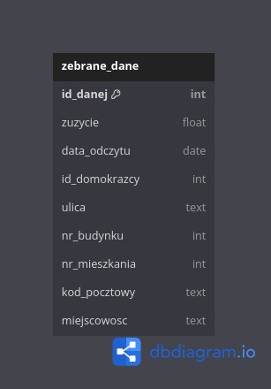

Sprawozdanie
============

Dawid Łapiński, Leon Woźniak
----------------------------

Założenia bazy danych:
~~~~~~~~~~~~~~~~~~~~~~
Baza danych miała powstać dla spółki energetycznej zajmującej się dystrybucją energii w woj. Dolnośląskim. Baza danych miała obejmować zarejestrowanych klientów, odczyty zużycia prądu przez klientów, adresy pod którymi mają zainstalowane liczniki, historię miejsc, w których znajdował się dany licznik oraz listę domokrążców, którzy by te liczniki sprawdzali. Zarejestrowani użytkownicy mieliby historię odczytów ze swojego licznika, żeby była możliwość tworzenia prognóz ile będą płacić za energię w następnych miesiąch. Dane z bazy nie byłyby usuwane, ponieważ firma prowadziłaby statystyki tj. ilość zainstalowanych liczników w danym okresie, ilość sprawdzonych liczników przez domokrążcę w danym okresie.
Dane zbierane przez domokrążców tj. zużycue prądu, data odczytu, adres klienta byłyby zapisywane w tymczasowej bazie danych, a potem zrzucane i importowane do głównej bazy danych.

Model koncepcyjny głównej bazy danych:
~~~~~~~~~~~~~~~~~~~~~~~~~~~~~~~~~~~~~~
.. image:: main_database.png

Główna baza danych przechowuje dane o klientach, adresach do nich przypisanych, licznika, który jest przypisany do każdego adresu, odczyty zuzycia prądu przez gospodarstwo pod danym adresem, domokrążców, którzy odczytali dany licznik oraz historię gdzie dany licznik był zamontowany. 

Model koncepcyjny tymczasowej bazy danych:
~~~~~~~~~~~~~~~~~~~~~~~~~~~~~~~~~~~~~~~~~~

