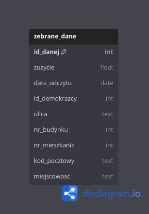

Sprawozdanie
============

Dawid Łapiński, Leon Woźniak
----------------------------

Założenia bazy danych
~~~~~~~~~~~~~~~~~~~~~
Baza danych miała powstać dla spółki energetycznej zajmującej się dystrybucją energii w woj. Dolnośląskim. Baza danych miała obejmować zarejestrowanych klientów, odczyty zużycia prądu przez klientów, adresy pod którymi mają zainstalowane liczniki, historię miejsc, w których znajdował się dany licznik oraz listę domokrążców, którzy by te liczniki sprawdzali. Zarejestrowani użytkownicy mieliby historię odczytów ze swojego licznika, żeby była możliwość tworzenia prognóz ile będą płacić za energię w następnych miesiącach. Dane z bazy nie byłyby usuwane, ponieważ firma prowadziłaby statystyki tj. ilość zainstalowanych liczników w danym okresie, ilość sprawdzonych liczników przez domokrążcę w danym okresie.
Dane zbierane przez domokrążców tj. zużycie prądu, data odczytu, adres klienta byłyby zapisywane w tymczasowej bazie danych, a potem zrzucane i importowane do głównej bazy danych. Przedstawiony zostanie tylko model fizyczny, ponieważ zawiera on wszystkie potrzebne informacje.

Model fizyczny tymczasowej bazy danych
~~~~~~~~~~~~~~~~~~~~~~~~~~~~~~~~~~~~~~

Tymczasowa baza danych dla pracownika zakłada, że będzie on wpisywał dane, które nie są danymi poufnymi tj. pesel, tylko na podstawie adresu, pod którym znajduje się licznik. Baza daje możliwość wprowadzenia numeru identyfikacyjnego domokrążcy, żeby określić jaki domokrążca sprawdził dany licznik. Jest to potrzebne przy uwzględnianiu ewentualnej premii. Kolejne dane to data odczytu, zużycie jakie pokazuje licznik oraz adres. Baza dodaje każdy wpis jako unikalny w całej bazie.

Instrukcja użytkownika
~~~~~~~~~~~~~~~~~~~~~~
Po uruchomieniu programu zostanie wyświetlone menu, z poziomu którego będzie można wybrać opcję zapisu odczytu liczników lub wyjścia z programu.
Użycie opcji zapisu odczytu liczników poprosi Cię o wpisanie numeru identyfikacyjnego oraz danych:

* Ulica
* Nr budynku
* Nr mieszkania (jeśli brak, naciśnij Enter, aby pozostawić puste)
* Kod pocztowy
* Miejscowość
* Zużycie

Sprawdzanie istnienia rekordu
~~~~~~~~~~~~~~~~~~~~~~~~~~~~~
Program sprawdzi, czy w bazie danych istnieje już rekord z podanym adresem:

Jeśli rekord istnieje, zostaniesz zapytany, czy chcesz zaktualizować istniejące zużycie (wpisz t dla tak lub n dla nie).
Jeśli rekord nie istnieje, dane zostaną dodane jako nowy rekord.

Kontynuowanie lub zakończenie programu
~~~~~~~~~~~~~~~~~~~~~~~~~~~~~~~~~~~~~~
Po wprowadzeniu danych zostaniesz zapytany, czy chcesz zakończyć wprowadzanie (wpisz t dla tak lub naciśnij Enter, aby kontynuować wprowadzanie kolejnych danych).

Zakończenie i eksport do CSV
~~~~~~~~~~~~~~~~~~~~~~~~~~~~
Po zakończeniu wprowadzania danych, wszystkie zapisane rekordy zostaną wyeksportowane do pliku zebrane_dane.csv. Program wyświetli również wszystkie rekordy na ekranie.
