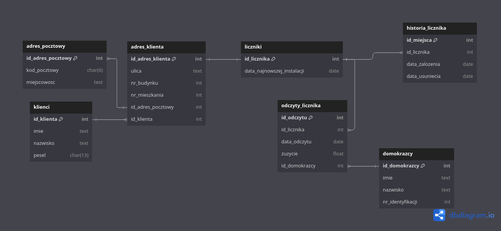

Główna baza danych
------------------

Model fizyczny głównej bazy danych
~~~~~~~~~~~~~~~~~~~~~~~~~~~~~~~~~~

Główna baza danych przechowuje dane o zarejestrowanych klientach, ich adresach (każdy klient może mieć więcej niż jeden dom/mieszkanie), adresach pocztowych oznaczających miasta i kody pocztowe, liczniku, który jest przypisany do każdego adresu (liczniki są w relacji jeden do jednego z adresami klientów, tzw. jeden licznik może być przypisany pod jeden adres), odczytach z danego licznika (jest to relacja jeden do wielu, ponieważ każdy licznik ma swoją historię odczytów), domokrążców, którzy te liczniki sprawdzają oraz historię miejsc liczników, w których przebywały (część związana z obsługą historii miejsc liczników nie została w pełni rozwinięta).
Założeniami tej bazy było jedynie wprowadzanie danych i nieusuwanie ich z powodów opisanych w rozdziale, pt. "Założenia bazy danych".
Baza jest w trzeciej postaci normalnej, ponieważ atrybuty są zależnie funkcyjne od klucza głównego (druga postać normalna) oraz baza nie ma przechodnich zależności funkcyjnych.
# dopisać coś ?

Funkcje bazy danych
~~~~~~~~~~~~~~~~~~~
Na wstępie pragniemy zaznaczyć, że kod pierwotnie był pisany na potrzeby uruchamiania odpowiednich skryptów jako oddzielnych modułów aplikacji. Dlatego też tylko jedna funkcja (chodzi dokładniej o funkcję "wykonaj_kod()" znajdującą się w każdym module) służy do obsługi jednego skryptu. 
Baza posiada następujące funkcje, które później zostaną szczegółowo opisane:

* Budowanie struktury bazy danych
* Dodawanie klientów wraz z adresami
* Czyszczenie wszystkich tabel (Trzeba od nowa zbudować strukturę bazy danych)
* Importowanie danych do bazy z pliku csv
* Wysłanie danych testowych
* Raportowanie o wydajności domokrążców
* Wyszukanie wszystkich danych o wprowadzonym kliencie

Uruchomienie odpowiednich funkcji odbywa się przez konsolę administratora znajdującą się w skrypcie o nazwie aplikacja_administratora.py

Opis funckcji
~~~~~~~~~~~~~
Funkcje są opisane kolejno jak występują w menu programu.

1. Wyślij zapisane dane do serwera

  * Funkcja importuje dane zgromadzone przez domokrążcę. Do poprawnego działania potrzebny jest plik w formacie csv, który będzie odczytany i dane z niego zostaną dodane do odczytów danego licznika. Plik wykonujący opisaną funkcję nazywa się "wyslij.py".

2. Wygeneruj raport o statystykach domokrążców

  * Tworzy zapytanie o domokrążców oraz całkowitą liczbę dodanych przez nich wpisów. Następnie na ich podstawie tworzy wykres słupkowy posortowany od domokrążcy z największą ilością wpisów. Plik wykonujący opisaną funkcję nazywa się "raport_o_domokrazcach.py".

3. Wyszukaj dane o osobie

  * Funkcja poprosi o wpisanie imienia, nazwiska oraz peselu i na podstawie tych danych zwróci wszystkie informacje o wybranej osobie. Plik wykonujący opisaną funkcję nazywa się "wyszukiwanie_w_bazie.py".

4. Usuń wszystkie tabele

  * Usuwa wszystkie tabele w bazie. Trzeba jeszcze raz utworzyć szkielet bazy, żeby można było móc na niej operować. Plik wykonujący opisaną funkcję nazywa się "usun_tabele.py".

5. Wyślij testowe dane do bazy

  * Wysyła testowe dane do bazy w celu zapełnienia jej do wykonania testów. Plik wykonujący opisaną funkcję nazywa się "wyslij_testowe.py".
